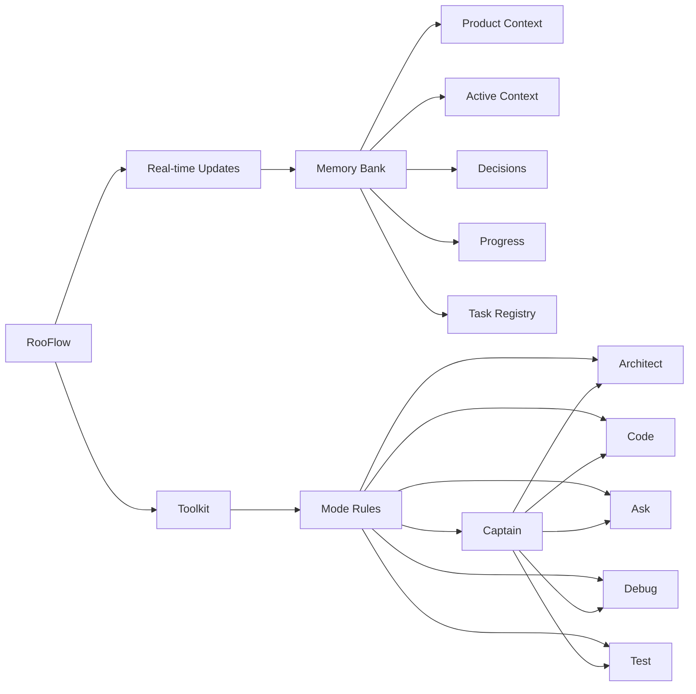

<div align="center">

# 🚀 RooFlow 🌊

**Persistent Project Context and Streamlined AI-Assisted Development**

[](https://github.com/RooVetGit/Roo-Code)
[](https://github.com/GreatScottyMac/RooFlow)

</div>

## 🎯 Overview

RooFlow enhances AI-assisted development in VS Code by providing **persistent project context** and **optimized mode interactions**, resulting in **reduced token consumption** and a more efficient workflow. It builds upon the concepts of the Roo Code Memory Bank, but streamlines the process and introduces a more integrated system of modes. RooFlow ensures your AI assistant maintains a deep understanding of your project across sessions, even after interruptions.

### Key Improvements over Roo Code Memory Bank:

* **Reduced Token Consumption:** Optimized prompts and instructions minimize token usage
* **Six Integrated Modes:** Captain, Architect, Code, Test, Debug, and Ask modes work together seamlessly
* **Project Orchestration:** Captain mode provides high-level project management and task delegation
* **Simplified Setup:** Easier installation and configuration
* **Streamlined Real-time Updates:** More efficient and targeted Memory Bank updates
* **Clearer Instructions:** Improved YAML-based rule files for better readability and maintainability

### Key Components



- 🧠 **Memory Bank**: Persistent storage for project knowledge (automatically managed)
- 💻 **System Prompts**: YAML-based core instructions for each mode (`.roo/system-prompt-[mode]`)
- 🔧 **VS Code Integration**: Seamless development experience within VS Code
- ⚡ **Real-time Updates**: Automatic Memory Bank updates triggered by significant events
- 🧢 **Captain Mode**: Project orchestration and task delegation system

## 🚀 Quick Start

### 1. Installation

1. **Install Roo Code Extension:** Ensure you have the Roo Code extension installed in VS Code.
2. **Download RooFlow Files:** Download the following files from this repository:
   * [`system-prompt-captain`](https://github.com/GreatScottyMac/RooFlow/blob/main/config/.roo/system-prompt-captain)
   * [`system-prompt-architect`](https://github.com/GreatScottyMac/RooFlow/blob/main/config/.roo/system-prompt-architect)
   * [`system-prompt-ask`](https://github.com/GreatScottyMac/RooFlow/blob/main/config/.roo/system-prompt-ask)
   * [`system-prompt-code`](https://github.com/GreatScottyMac/RooFlow/blob/main/config/.roo/system-prompt-code)
   * [`system-prompt-debug`](https://github.com/GreatScottyMac/RooFlow/blob/main/config/.roo/system-prompt-debug)
   * [`system-prompt-test`](https://github.com/GreatScottyMac/RooFlow/blob/main/config/.roo/system-prompt-test)
   * [`.rooignore`](https://github.com/GreatScottyMac/RooFlow/blob/main/config/.rooignore)
   * [`.roomodes`](https://github.com/GreatScottyMac/RooFlow/blob/main/config/.roomodes)
   * [`insert-variables.cmd`](https://github.com/GreatScottyMac/RooFlow/blob/main/config/insert-variables.cmd) (For Windows OS)
   * [`insert-variables.sh`](https://github.com/GreatScottyMac/RooFlow/blob/main/config/insert-variables.sh) (For Unix/Linux/macOS)

3. **Place Files in Project:**
   * Create a directory named `.roo` in your project's root directory
   * Place the `system-prompt-[mode]` files inside the `.roo` directory
   * Place the `.rooignore` file in the project's root directory (or add `!memory-bank/` to your existing .rooignore file)
   * Place the `.roomodes` file in the project's root directory (or add its contents to your existing .roomodes file)
   * Place the appropriate `insert-variables.[sh/cmd]` script for your platform in the project's root directory

Your project structure should look like this:

```
project-root
 ├── .roo
 |    ├── system-prompt-captain
 |    ├── system-prompt-architect
 |    ├── system-prompt-ask
 |    ├── system-prompt-code
 |    ├── system-prompt-debug
 |    └── system-prompt-test
 ├── memory-bank (This directory will be created automatically by Roo after your first prompt)
 |    ├── activeContext.md
 |    ├── decisionLog.md
 |    ├── productContext.md
 |    ├── progress.md
 |    ├── systemPatterns.md
 |    └── taskRegistry.md
 ├── .rooignore
 ├── .roomodes
 └── insert-variables.[sh/cmd]
```

4. **Run insert-variables script**

#### For Windows:
1. Open Command Prompt or PowerShell
2. Navigate to your project:
   ```cmd
   cd path\to\your\project
   ```
3. Run the script:

   From Command Prompt:
   ```cmd
   insert-variables.cmd
   ```

   From PowerShell:
   ```powershell
   .\insert-variables.cmd
   ```

   **Troubleshooting (Windows)**
   * **If you get "access denied" or execution policy errors:**
     1. Open PowerShell as Administrator
     2. Run this command once:
        ```powershell
        Set-ExecutionPolicy RemoteSigned -Scope CurrentUser
        ```
     3. Close Administrator PowerShell
     4. Try running the script again from your project directory
   * **If you see "Error: .roo directory not found", verify your directory structure.**
   * **If using PowerShell 7+, run as:**
      ```powershell
      cmd /c insert-variables.cmd
      ```

#### For Unix/Linux/macOS
1. Open Terminal
2. Navigate to your project:
   ```bash
   cd path/to/your/project
   ```
3. Make the script executable:
   ```bash
   chmod +x insert-variables.sh
   ```
4. Run the script:
   ```bash
   ./insert-variables.sh
   ```

   **Troubleshooting (Unix/Linux/macOS)**
   * **If you see "Permission denied", run:**
      ```bash
      sudo chmod +x insert-variables.sh
      ```
   * **If you see "Error: .roo directory not found", verify your directory structure**

#### Expected Output
The script will:
1. Detect your system configuration
2. Process each system prompt file
3. Show "Processing" and "Completed" messages for each file
4. Display "Done" when finished

#### Variables Being Replaced
The script replaces these placeholders with your system-specific values:
- OS_PLACEHOLDER (e.g., "Windows 10 Pro" or "Ubuntu 22.04")
- SHELL_PLACEHOLDER (e.g., "cmd" or "bash")
- HOME_PLACEHOLDER (your home directory)
- WORKSPACE_PLACEHOLDER (your project directory)
- GLOBAL_SETTINGS_PLACEHOLDER (Roo Code global settings path)
- MCP_LOCATION_PLACEHOLDER (Roo Code MCP directory path)
- MCP_SETTINGS_PLACEHOLDER (Roo Code MCP settings path)

### 2. Using RooFlow

1. **Start a Chat:** Open a new Roo Code chat in your project
2. **Select a Mode:** Choose the appropriate mode for your task:
   * **Captain Mode:** For project orchestration, task breakdown, and delegation
   * **Architect Mode:** For system design and architecture
   * **Code Mode:** For implementation and coding tasks
   * **Test Mode:** For testing and quality assurance
   * **Debug Mode:** For troubleshooting and bug fixing
   * **Ask Mode:** For questions and research
3. **Interact with Roo:** Give Roo instructions and ask questions. Roo will automatically use the Memory Bank to maintain context
4. **Memory Bank Initialization:** If you start a chat in a project *without* a `memory-bank/` directory, Roo will suggest switching to Architect mode and guide you through the initialization process
5. **"Update Memory Bank" Command:** At any time, you can type "Update Memory Bank" or "UMB" to force a synchronization of the chat session's information into the Memory Bank

## 📚 Memory Bank Structure

The Memory Bank is a directory named `memory-bank` located in your project's root. It contains several Markdown files that store different aspects of your project's knowledge:

| File | Purpose |
|------|---------|
| `activeContext.md` | Tracks the current session's context: recent changes, current goals, and open questions/issues |
| `decisionLog.md` | Records architectural and implementation decisions, including the context, decision, rationale, and implementation details |
| `productContext.md` | Provides a high-level overview of the project, including its goals, features, and overall architecture |
| `progress.md` | Tracks the progress of the project, including completed work, current tasks, and next steps. Uses a task list format |
| `systemPatterns.md` | (Optional) Documents recurring patterns and standards used in the project (coding patterns, architectural patterns, testing patterns) |
| `taskRegistry.md` | (Captain mode) Tracks all tasks, their status, assigned modes, and outcomes. Used for project orchestration and task management |

RooFlow automatically manages these files. You generally don't need to edit them directly, although you can review them to understand the AI's knowledge.

## 🧢 Captain Mode

The Captain Mode serves as a project orchestrator and task manager. It provides high-level project oversight, breaks down complex tasks, and delegates them to specialized modes.

### Key Features

- **Project Orchestration:** Maintains a high-level view of the entire project
- **Task Decomposition:** Breaks down complex tasks into smaller, well-defined subtasks
- **Task Delegation:** Assigns tasks to the most appropriate specialized modes
- **Progress Tracking:** Monitors task status and project progress
- **Memory Bank Management:** Ensures project context is maintained and updated

### When to Use Captain Mode

Captain Mode is ideal for:
- Starting new projects that require coordination between multiple aspects
- Managing complex features that span multiple domains
- Organizing work across different specialized areas
- Maintaining project overview and ensuring coherent progress

For more information, see the [Captain Mode documentation](docs/captain-mode.md).

## ✨ Features

### 🧠 Persistent Context

RooFlow remembers project details across sessions, maintaining a consistent understanding of your codebase, design decisions, and progress.

### ⚡ Real-time Updates

The Memory Bank is updated automatically based on significant events within each mode, ensuring that the context is always up-to-date.

### 🤝 Mode Collaboration

The six modes (Captain, Architect, Code, Test, Debug, Ask) are designed to work together seamlessly. The Captain mode serves as the orchestrator, delegating tasks to specialized modes. All modes share information through the Memory Bank.

### ⬇️ Reduced Token Consumption

RooFlow is designed to use fewer tokens than previous systems, making it more efficient and cost-effective.

## 📝 UMB Command

The command "Update Memory Bank" or "UMB" can be given at any time to update the memory bank with information from the current chat session.

## 🔧 MCP Server Tools

RooFlow supports MCP (Model Context Protocol) server tools. If you encounter issues with MCP functionality, there is a global [Default mode](https://github.com/GreatScottyMac/RooFlow/blob/main/config/default-mode/README.md) available which runs with the Roo Code default system prompt.

## Contributing

Contributions to RooFlow are welcome! Please see the [CONTRIBUTING.md](CONTRIBUTING.md) file for guidelines.

## License

[Apache 2.0](LICENSE)
